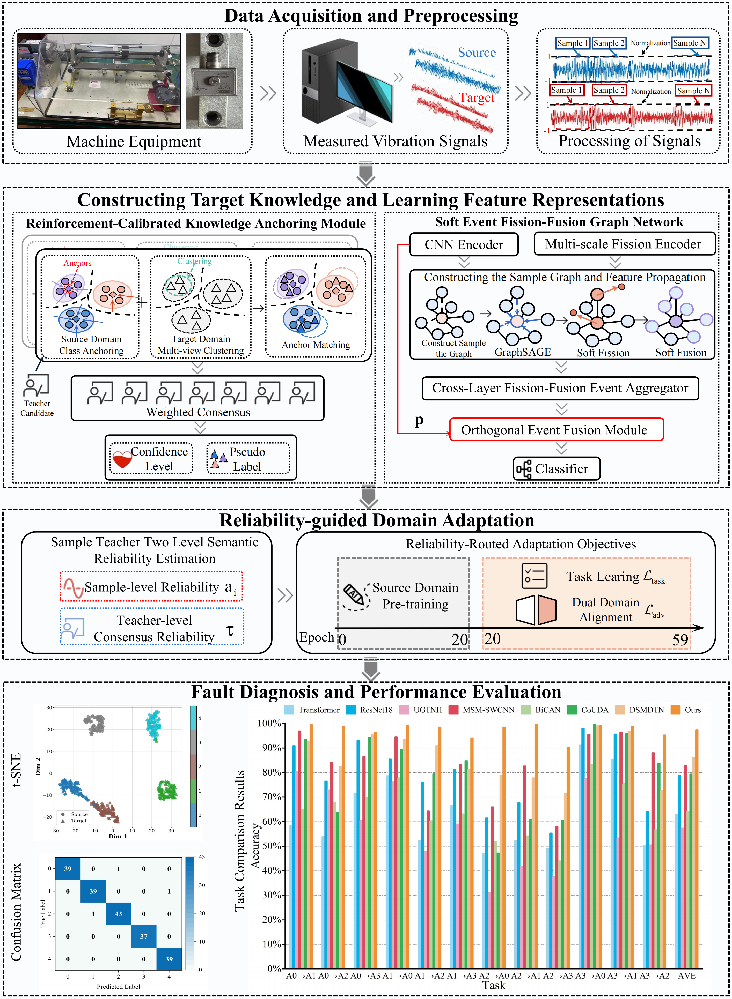

# SEFFG-RCKA
# Availability Notice

 **Note:** This repository currently contains only a partial release of the project. The complete source code, configuration files, and related resources will be made publicly available after the associated paper is accepted for publication.

 **Soft event fission-fusion graph network with reinforcement-calibrated knowledge anchoring (SEFFG-RCKA)** for cross-condition fault diagnosis 
diagnosis.



## Environment

The recommended environment is:

- Python 3.10
- PyTorch 2.8.0
- PyTorch Geometric 2.6.1
- CUDA-compatible NVIDIA GPU

Create and activate a Conda environment:

```bash
conda create -n SEFFG-RCKA python=3.10 -y
conda activate SEFFG-RCKA
```

Install the required packages:

```bash
pip install -r requirements.txt
```

For GPU training, ensure that the installed PyTorch build matches the CUDA
version supported by the local NVIDIA driver. If necessary, install PyTorch
from the official wheel index before installing the remaining dependencies.

Verify the main dependencies:

```bash
python -c "import torch, torch_geometric; print(torch.__version__); print(torch.cuda.is_available()); print(torch_geometric.__version__)"
```

## Dataset Preparation

The training code currently supports the following datasets:

- `HUST`: HUSTbearing dataset

Specify the dataset directory using `--data_dir`. The source and target
operating conditions are defined by `--transfer_task`. For example,
`"[[1],[2]]"` represents condition 1 as the source domain and condition 2 as
the target domain.

Target-domain ground-truth labels are not used for gradient-based model
training. They are retained only by the experimental evaluation protocol.

## Training

`train_advanced.py` is the public entry point for training the complete SEFFG-RCKA
model. It calls `utils/train_utils_combines.py`, which contains the complete
training path without dedicated ablation interfaces.

### HUSTbearing example
https://github.com/CHAOZHAO-1/HUSTbearing-dataset
```bash
python train_advanced.py \
  --dataset HUST \
  --data_dir /path/to/HUST \
  --transfer_task "[[1],[2]]" \
  --cuda_device 0 \
  --checkpoint_dir ./results/HUST
```

The default training schedule contains 60 epochs. The first 20 epochs are
used for source-domain supervised pretraining, and the remaining 40 epochs
perform target-domain adaptation.

## Outputs

Each run creates a task-specific directory under `--checkpoint_dir`. The
directory contains:

- training logs;
- target-domain diagnostic results;
- feature-distribution and confusion-matrix figures generated by the trainer.

## Main Files

```text
train_advanced.py                  Complete SEFFG-RCKA training entry
requirements.txt                Python dependencies
datasets/                       Dataset loading and preprocessing
models/                         CCSEFFG and domain-adaptation networks
utils/dual_view_spectral_uda.py RL-MA-DVSCA implementation
utils/train_utils_combines.py  Complete training and evaluation procedure
```
